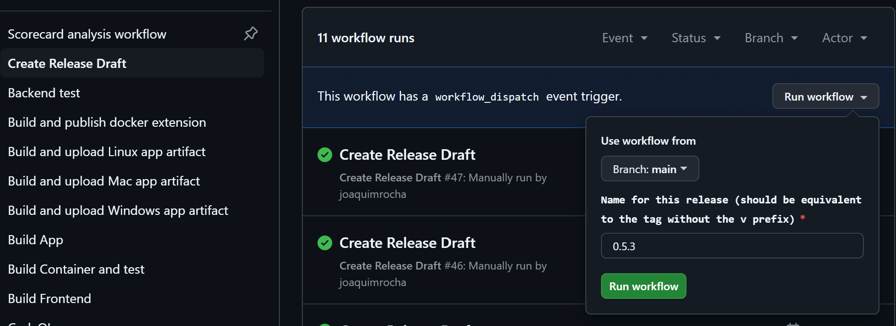

This document describes how to perform a Headlamp release.

The idea is that we list the steps here as a guide and automate it along the way, so the number of steps is reduced as much as possible in the future.

## Version bumping

We follow the [semantic versioning](https://semver.org/) guide.

## Steps to perform a Headlamp release  

When ready to perform a release (changes worth releasing since last time is done, QA is done), then:

### 1. Create a new branch

Create a new branch called "rc-X.Y.Z" where X.Y.Z is the new release version.

### 2. Bump the app “version”

If using the automated **Headlamp Releaser** tool (recommended), run the `start` command to automate version bumping, dependency installations, Helm template regeneration, and committing:

```shell
# Navigate to the releaser directory, install deps, build/link it, and start the release
cd tools/releaser
npm install
npm run build && npm link
releaser start X.Y.Z
```

This will automatically commit the changes with the message:
`releaser: bump version to X.Y.Z`

If performing the version bump manually instead:
On the release branch, bump the “version” field in `app/package.json`, run `npm install` inside `app/` (and update Helm Chart version/templates if applicable), then stage and commit the changes with:

```shell
git add app/package.json app/package-lock.json charts/headlamp/Chart.yaml charts/headlamp/tests/expected_templates
git commit --signoff -m "releaser: bump version to X.Y.Z"
```

Bug fix: make a branch off the tag, and cherry pick everything in. Or make a branch off main and remove merge commits compared to previous tag (On the branch to remove merge commits, do: "`git rebase main`").

```shell
git log v0.25.0.. --oneline
```


### 3. Start a release draft

Start a release draft by manually running the "Create release draft" action (it's important to give it the right release name as it creates links with that number in the draft):



### 4. Check the list of changes since the last release

Check the list of changes since the last release:

```
git log \`git describe \--abbrev=0\`..
```

Then go to the release draft created in the previous step and fill it accordingly.

Look at previous releases. Write for humans: no context part, like "frontend:". Put github user name in "(thanks @XXX )" at end of line for external contributors.


### 5. App signing

The build scripts handle app signing.

### 6. Generate Apps

Generate the apps for each the Linux, Windows, and Mac platforms by running the "Build and upload PLATFORM artifact" actions against the "rc-X.Y.Z".

### 7. Download and test Artifacts

Download the artifacts, test them and, if everything goes well, upload them to the new release's assets area.

### 8. Push Assets

Upload the assets to the release by running the **Upload Release Assets**
workflow (`.github/workflows/push-release-assets.yml`) from the GitHub Actions
UI. Run it from the `main` branch, not the release branch: users verify the
signature against the workflow on `main`, so the workflow refuses to run from
any other branch. Give it the release name (e.g. `0.42.0`) and the comma-separated run IDs of
the "Build and upload PLATFORM artifact" workflows from step 6. You can list
those runs with `releaser ci app --list`.

The workflow uploads the assets, updates `checksums.txt`, and **signs it** with
cosign keyless signing. It uploads the signature as `checksums.txt.sigstore.json`,
and fails if it is not attached to the release. Users rely on this signature to
verify downloads (see [Verifying Releases](../installation/verify-releases.md)),
so always use the workflow, and make sure it succeeded before publishing the
release. `releaser check X.Y.Z` also reports a missing signature (see step 9).

Do not upload assets manually with `app/scripts/push-release-assets/push-release-assets.js`,
because that skips signing. If you need to add or replace an asset, re-run the
workflow with the run ID of the build that produced it (set `force` if the
release is no longer a draft), so that `checksums.txt` is signed again.

Note: The workflow uses the `RELEASE_UPDATE_TOKEN` secret configured in the
repository. If it fails because the token has expired, ask a maintainer with
admin access to the repository to rotate it.


### 9. Push the new tag

Go to the main branch and merge the rc-X.Y.Z in, then create a **signed** tag
(notice the **v** before the version number). Use `releaser tag`, which signs
the tag by default, or:

```shell
git tag -s vX.Y.Z -m "Release X.Y.Z"
```

Make sure your GPG or SSH signing key is
[added to your GitHub account](https://docs.github.com/en/authentication/managing-commit-signature-verification)
as a signing key, so that the tag shows as **Verified**. `releaser publish`
refuses to push an unsigned tag, and doesn't publish the release if GitHub
reports the pushed tag's signature as invalid. It only warns if GitHub can't
match the signing key to your GitHub account. You can also check the tag
yourself: look for the **Verified** label on the
[tags page](https://github.com/kubernetes-sigs/headlamp/tags), or run
`git tag -v vX.Y.Z` (see [Verifying Releases](../installation/verify-releases.md#source-code)).

:::warning
Push the signed tag **before** publishing the release draft, either with
`releaser publish` or with the commands below. If the draft is published while
the tag doesn't exist yet, GitHub creates an unsigned, lightweight tag from the
latest commit on `main`. That commit may not be the release commit (this
happened with v0.44.0).
:::


Push the new release commit and tags:

Note: DO NOT RUN THIS BELOW EXCEPT ON NEW FEATURE RELEASES.

```shell
git checkout main

git merge rc-X.Y.X \# (this should NOT create a merge commit since the bump commit is the only difference)

git push origin main

git push \--tags
```

Then publish the release with `releaser publish X.Y.Z`, which checks that the
tag is signed, attaches it to the draft, and publishes the draft. If you publish
the draft from the GitHub UI instead, select the existing `vX.Y.Z` tag.

However you uploaded the assets, created the tag, or published the release, run
`releaser check X.Y.Z` before publishing and again afterwards. It fails if the
`checksums.txt` signature is missing, or if the tag is not signed or its
signature is invalid, e.g. because it was made with an expired key. It warns if
GitHub can't match the signing key to the tagger's GitHub account, or couldn't
check the signature at the moment.

### 10. Container images and distribution channels (flathub, homebrew)

Container images are built automatically on every tag creation, pushed to the GitHub Container Registry (ghcr.io), and signed with cosign.

Other distribution channels like flathub, homebrew, minikube, will be done by automatically opened PRs.

### 11. Announce on social media

Ask someone in the social team (Joaquim or Chris) to toot/tweet/post about it from the social media accounts.
