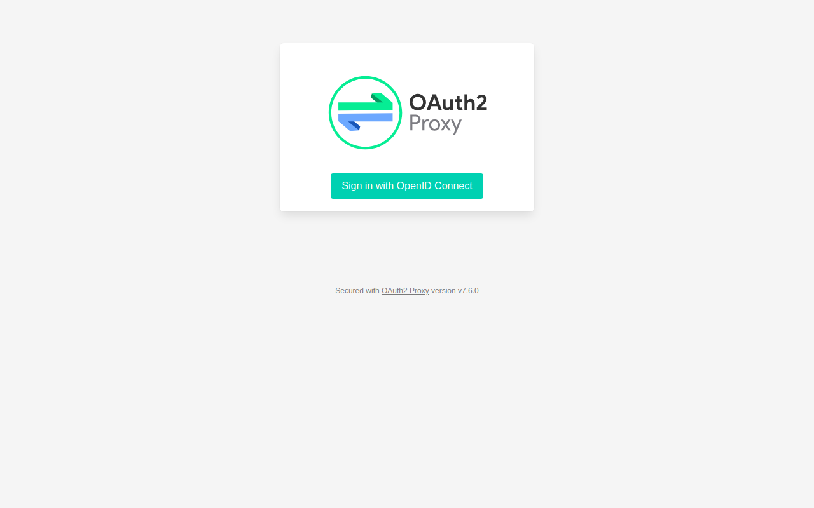
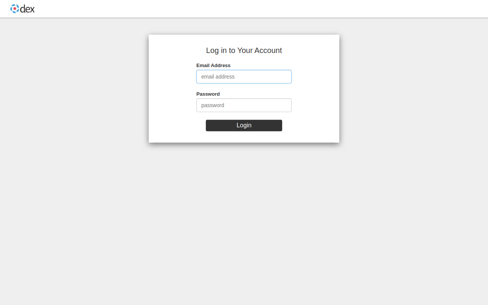
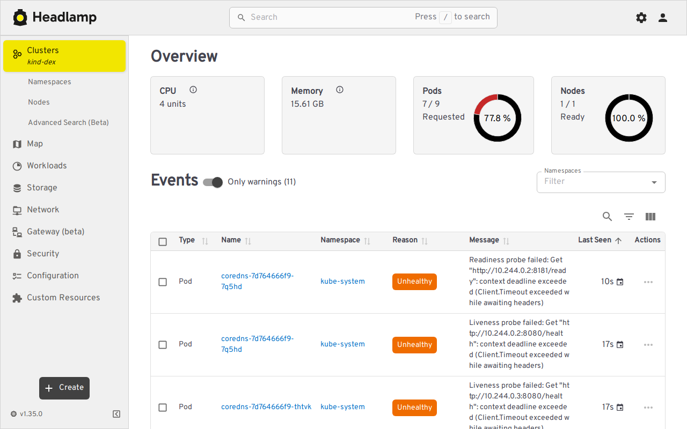

In this tutorial, we'll walk through configuring Headlamp on a Minikube cluster
and protecting it with [OAuth2-Proxy](https://oauth2-proxy.github.io/oauth2-proxy/),
which delegates authentication to a [Dex](https://dexidp.io/) OIDC provider.

This is the **recommended pattern** for using Headlamp with Dex: rather than
having Headlamp speak OIDC directly to Dex, OAuth2-Proxy sits in front of
Headlamp, performs the OIDC login flow with Dex, and then forwards the
authenticated user's token to Headlamp via an `Authorization: Bearer …`
header. Headlamp uses that token to call the Kubernetes API on the user's
behalf, so RBAC is enforced based on the real Dex identity.

You can find the same approach documented upstream:
[OAuth2-Proxy → Headlamp integration](https://oauth2-proxy.github.io/oauth2-proxy/configuration/integrations/headlamp).

## Architecture

The diagram below illustrates the flow described in the next paragraph
(text equivalent provided for screen readers): the user's browser hits
OAuth2-Proxy (0), which performs an OIDC login with Dex (1), then
forwards the request to Headlamp with the `id_token` attached as an
`Authorization: Bearer …` header (2); Headlamp calls the Kubernetes API
server with that same token (3), and the API server validates it against
Dex's discovery document.

```text
                                   ┌──── Dex (OIDC provider) ────┐
                                   │ - validates user / password │
                                   │ - issues id_token           │
                                   └─────────────▲───────────────┘
                                                 │ (1) OIDC login
 user's browser ── (0) http ──► OAuth2-Proxy ────┘
                                  │
                                  │ (2) forwards request, injects
                                  │     Authorization: Bearer <id_token>
                                  ▼
                              Headlamp ── (3) calls k8s API with the bearer token ──► Kubernetes API server
                                                                                       (validates token via Dex OIDC)
```

The Kubernetes API server is configured to trust ID tokens issued by Dex
(`--oidc-issuer-url`, `--oidc-client-id`, …), so the same `id_token` that
authenticates the user to Headlamp is the one Headlamp uses to authenticate
itself to the API server. RBAC bindings are made against the email/username
claims provided by Dex.

## What you'll need

- [Minikube](https://minikube.sigs.k8s.io/) ≥ 1.31
- [Helm](https://helm.sh/) ≥ 3.10
- `kubectl`
- A local install of [Dex](https://dexidp.io/docs/getting-started/) (binary or container) — version 2.38.0 or newer

> **Try it yourself.** A complete set of scripts and manifests reproducing
> all the steps below is provided in the [`test-scripts/`](https://github.com/kubernetes-sigs/headlamp/tree/main/docs/installation/in-cluster/dex/test-scripts)
> folder next to this tutorial. You can run `./test-scripts/run.sh` to bring
> up the whole stack and `./test-scripts/cleanup.sh` to tear it down again.

This tutorial was written and tested against Headlamp 0.36, OAuth2-Proxy 7.x,
Dex 2.45, and Minikube 1.34.

## Step 1 — Configure and start Dex

Create a Dex configuration file. Note the **redirect URI**: with this new
setup, the OIDC redirect target is no longer Headlamp itself; it is the
`/oauth2/callback` path served by OAuth2-Proxy.

```yaml title="dex-config.yaml"
issuer: http://<YOUR-DEX-HOST>:5556

storage:
  type: sqlite3
  config:
    # `/tmp/dex.db` works when you run `dex serve` directly as your user.
    # If you run Dex in a container or systemd unit, point this at a
    # writable persistent path you actually mount/own (for example
    # `/var/lib/dex/dex.db` with the directory created and chowned).
    file: /tmp/dex.db

web:
  http: 0.0.0.0:5556

staticClients:
  - id: headlamp
    name: "Headlamp via OAuth2-Proxy"
    secret: headlamp-oauth2-proxy-secret
    redirectURIs:
      # OAuth2-Proxy callback (port-forwarded in this tutorial).
      - "http://localhost:8080/oauth2/callback"

enablePasswordDB: true

staticPasswords:
  - email: "admin@example.com"
    # bcrypt hash of "password":
    #   $(echo password | htpasswd -BinC 10 admin | cut -d: -f2)
    hash: "$2a$10$2b2cU8CPhOTaGrs1HRQuAueS7JTT5ZHsHSzYiFPm1leZck7Mc8T4W"
    username: "admin"
    userID: "08a8684b-db88-4b73-90a9-3cd1661f5466"
```

Replace `<YOUR-DEX-HOST>` with a host name that is reachable from:

1. Your **browser** (so the user can complete the login).
2. The **Kubernetes API server** (so it can fetch Dex's OIDC discovery
   document to validate `id_token`s).
3. The **OAuth2-Proxy pod** running inside Minikube.

A common convention when running Dex on the host machine is
`host.minikube.internal` (which Minikube resolves to the host) — see the
test scripts for an example.

Start Dex:

```shell
dex serve dex-config.yaml
```

## Step 2 — Start Minikube with OIDC API-server flags

The Kubernetes API server has to be told to trust Dex as an OIDC issuer:

```shell
minikube start -p=dex \
  --extra-config=apiserver.authorization-mode=Node,RBAC \
  --extra-config=apiserver.oidc-issuer-url=http://<YOUR-DEX-HOST>:5556 \
  --extra-config=apiserver.oidc-username-claim=email \
  --extra-config=apiserver.oidc-client-id=headlamp
```

If you serve Dex over HTTPS with a self-signed certificate (recommended for
anything beyond a local demo), also pass `--extra-config=apiserver.oidc-ca-file=…`
and mount the CA file on the Minikube node.

> **Note for the runnable test scripts.** The `test-scripts/run.sh` helper
> deliberately omits the `apiserver.oidc-*` flags above and starts Minikube
> with just `--extra-config=apiserver.authorization-mode=Node,RBAC`. The
> scripts run Dex over plain HTTP for simplicity, and `kube-apiserver`
> rejects `--oidc-issuer-url` values that don't use `https://`. In the
> OAuth2-Proxy + Dex pattern the API server doesn't need to know about
> the OIDC issuer to demo the login flow — Headlamp talks to the API
> server using its in-cluster ServiceAccount (see `headlamp-values.yaml`).
> The flags above are only needed when you want per-user RBAC against
> the API server in production, in which case you should also be running
> Dex over HTTPS as described in the previous paragraph.

## Step 3 — Create a ClusterRoleBinding for the Dex user

We tell Kubernetes that the email `admin@example.com` (the email claim Dex
will issue) maps to `cluster-admin`:

```yaml title="clusterrolebinding.yaml"
apiVersion: rbac.authorization.k8s.io/v1
kind: ClusterRoleBinding
metadata:
  name: admin-user-clusterrolebinding
subjects:
  - kind: User
    name: admin@example.com
    apiGroup: rbac.authorization.k8s.io
roleRef:
  kind: ClusterRole
  name: cluster-admin
  apiGroup: rbac.authorization.k8s.io
```

```shell
kubectl apply -f clusterrolebinding.yaml
```

## Step 4 — Install Headlamp

With this setup, Headlamp itself does **not** need any OIDC configuration —
authentication is handled entirely by OAuth2-Proxy. Install it with the
default Helm chart values:

```shell
helm repo add headlamp https://kubernetes-sigs.github.io/headlamp/
helm repo update
helm install headlamp headlamp/headlamp \
  --namespace headlamp --create-namespace
```

Verify it is running:

```shell
kubectl get pods -n headlamp
```

## Step 5 — Install OAuth2-Proxy in front of Headlamp

OAuth2-Proxy will:

- Authenticate users against Dex (OIDC).
- Inject an `Authorization: Bearer <id_token>` header into every request it
  forwards to Headlamp.
- Proxy the (now authenticated) request to the in-cluster Headlamp service.

The snippet below is a minimal, production-shaped values file. The
runnable
[`test-scripts/oauth2-proxy-values.yaml.tpl`](https://github.com/headlamp-k8s/headlamp/blob/main/docs/installation/in-cluster/dex/test-scripts/oauth2-proxy-values.yaml.tpl)
adds a few extra knobs that are only safe for the local-only
`kubectl port-forward` demo (`cookie_secure = false`,
`insecure_oidc_allow_unverified_email = true`,
`ssl_insecure_skip_verify = true`); do **not** carry those into a
real deployment.

```yaml title="oauth2-proxy-values.yaml"
config:
  clientID: "headlamp"
  clientSecret: "headlamp-oauth2-proxy-secret"
  # Generate with: openssl rand -base64 32 | tr '+/' '-_' | tr -d '='
  cookieSecret: "<RANDOM-32-BYTE-BASE64URL-VALUE>"
  configFile: |-
    email_domains = ["*"]
    # Tell oauth2-proxy how to reach Dex.
    provider = "oidc"
    oidc_issuer_url = "http://<YOUR-DEX-HOST>:5556"
    redirect_url = "http://localhost:8080/oauth2/callback"

    # Ask Dex for the claims we need.
    scope = "openid profile email groups"

    # Forward the user's OIDC id_token to Headlamp as
    # `Authorization: Bearer <id_token>`, so Headlamp can call the
    # Kubernetes API server on the user's behalf. With provider = "oidc",
    # `pass_authorization_header` forwards the id_token (not the access
    # token) — which is what Headlamp expects by default.
    pass_authorization_header = true

    # Where to send the (authenticated) request.
    upstreams = ["http://headlamp.headlamp.svc.cluster.local:80"]

    # Listen on all interfaces inside the pod.
    http_address = "0.0.0.0:4180"
    reverse_proxy = true
```

> **Why `pass_authorization_header`?**
> With `provider = "oidc"`, this flag makes OAuth2-Proxy place the Dex
> `id_token` (not the access token) into the `Authorization: Bearer …`
> header on the request it forwards to Headlamp. Headlamp picks that
> header up and uses the token when talking to the Kubernetes API. The
> API server, configured in step 2, validates the token against Dex and
> applies RBAC.
>
> Headlamp uses the `id_token` for OIDC auth by default; if you have set
> `-oidc-use-access-token` (`HEADLAMP_CONFIG_OIDC_USE_ACCESS_TOKEN`) on
> Headlamp, configure OAuth2-Proxy to forward the access token instead.

Install OAuth2-Proxy:

```shell
helm repo add oauth2-proxy https://oauth2-proxy.github.io/manifests
helm repo update
helm install oauth2-proxy oauth2-proxy/oauth2-proxy \
  --namespace headlamp \
  -f oauth2-proxy-values.yaml
```

## Step 6 — Open Headlamp through OAuth2-Proxy

Port-forward to OAuth2-Proxy (**not** to Headlamp directly — going directly
would bypass authentication):

```shell
kubectl port-forward svc/oauth2-proxy 8080:80 -n headlamp
```

Open <http://localhost:8080>. OAuth2-Proxy presents its **Sign in** page:



Click **Sign in with OpenID Connect** and you are redirected to Dex. Sign
in as `admin@example.com` / `password`:



After login you are returned to `http://localhost:8080/oauth2/callback`,
OAuth2-Proxy issues its session cookie, and the request is proxied through
to Headlamp with the Dex `id_token` attached as an `Authorization: Bearer`
header. Headlamp uses that token to talk to the API server, which
authorizes the request via the `ClusterRoleBinding` from step 3:



> The screenshots above were captured against a local Dex + OAuth2-Proxy +
> Headlamp stack running through the [`test-scripts/`](./test-scripts/)
> in this folder.

## Going to production

This tutorial uses HTTP and port-forwarding for clarity; for any non-local
deployment you should:

- Serve Dex and OAuth2-Proxy over HTTPS, ideally fronted by an Ingress
  controller. Update `redirectURIs`, `oidc_issuer_url`, and `redirect_url`
  accordingly.
- Generate a strong, random `cookieSecret` (32 bytes, base64-url encoded)
  and store it in a `Secret`.
- Restrict `email_domains` to your organization's domains.
- Configure `--oidc-ca-file` on the API server when using a private CA.
- Place RBAC bindings against group claims rather than individual emails
  whenever possible.

## Troubleshooting

- **You're redirected to Dex but get an `invalid_redirect_uri` error.** Make
  sure the `redirectURIs` in `dex-config.yaml` exactly matches
  `redirect_url` in `oauth2-proxy-values.yaml`.
- **Headlamp loads but you have no permissions.** The user's email/group
  claim from Dex must match a `ClusterRoleBinding` (or `RoleBinding`).
  `kubectl auth can-i --as=admin@example.com get pods` is a good debugging
  command.
- **Headlamp shows a Kubernetes API authentication error.** The API server
  could not validate the `id_token`. Verify that `--oidc-issuer-url` on the
  API server is reachable from inside the cluster and that the issuer URL
  matches the `iss` claim in the token (use <https://jwt.io> to inspect).

## Conclusion

We've set up a Minikube cluster where Headlamp runs behind OAuth2-Proxy,
with Dex as the identity provider. OAuth2-Proxy handles the entire OIDC
flow and forwards the user's identity to both Headlamp and the Kubernetes
API server via a `Bearer` token, so existing Kubernetes RBAC just works.

For a fully scripted version of this tutorial that you can spin up in one
command, see [`test-scripts/`](https://github.com/kubernetes-sigs/headlamp/tree/main/docs/installation/in-cluster/dex/test-scripts).
