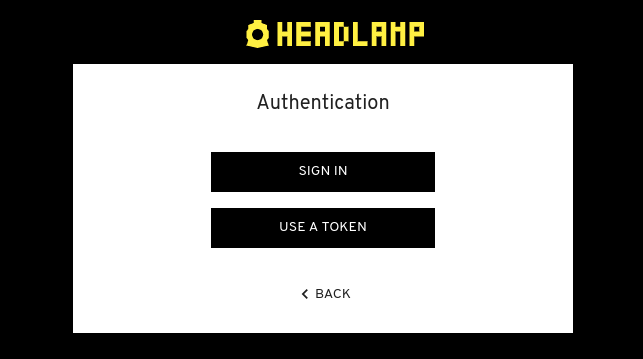

Headlamp supports OIDC for cluster users to effortlessly log in using a "Sign in" button.



To use OIDC, Headlamp needs the following arguments from your OIDC provider:

- the client ID: `-oidc-client-id` or env var `HEADLAMP_CONFIG_OIDC_CLIENT_ID`
- the client secret: `-oidc-client-secret` or env var `HEADLAMP_CONFIG_OIDC_CLIENT_SECRET`
- the issuer URL: `-oidc-idp-issuer-url` or env var `HEADLAMP_CONFIG_OIDC_IDP_ISSUER_URL`
- (optionally) the OpenID scopes: `-oidc-scopes` or env var `HEADLAMP_CONFIG_OIDC_SCOPES`

### Callback URL

You must tell your OIDC provider the callback URL that Headlamp will use after login. This is your Headlamp URL plus `/oidc-callback`, for example:
```
https://YOUR_URL/oidc-callback
```

> **Note:** If you're running Headlamp behind an ingress or load balancer (e.g., NGINX, AWS ALB/NLB), make sure it forwards the `X-Forwarded-Proto` header. Otherwise, Headlamp may generate the callback URL using `http` instead of `https`, which can cause a mismatch with your OIDC provider.
>
> For [NGINX ingress](https://kubernetes.github.io/ingress-nginx/user-guide/nginx-configuration/annotations/), you can add:
>
> ```yaml
> nginx.ingress.kubernetes.io/configuration-snippet: |
>   proxy_set_header X-Forwarded-Proto $scheme;
> ```

### Scopes

Besides the mandatory _openid_ scope, Headlamp also requests the optional _profile_ and _email_
[scopes](https://openid.net/specs/openid-connect-basic-1_0.html#Scopes).
Scopes can be overridden by using the `-oidc-scopes` option. Remember to include the default ones if you need them when using that option. For example, to keep the defaults and add GitHub's `repo` scope:

`-oidc-scopes=profile,email,repo`

**Note:** Before Headlamp 0.3.0, a scope _groups_ was also included, as it's used by Dex and other services, but since it's not part of the default spec, it was removed in the mentioned version.

### Token Validation Overrides

If your OIDC provider issues an `access_token` from a different issuer URL or clientID audience than its `id_token` (e.g. Azure Entra ID), use the following parameters to configure token validation:

- `-oidc-validator-client-id=<clientID audience to validate in token>` or env var `HEADLAMP_CONFIG_OIDC_VALIDATOR_CLIENT_ID` — the clientID Headlamp should verify in the `aud` field of the token.
- `-oidc-validator-idp-issuer-url=<issuerURL to use in validation>` or env var `HEADLAMP_CONFIG_OIDC_VALIDATOR_IDP_ISSUER_URL` — the issuer URL Headlamp should verify in the `iss` field of the token.

### Use Access Tokens instead of ID Tokens

By default, Headlamp uses the `id_token` returned after authentication. For some providers like Azure Entra ID, the `access_token` is required for Kubernetes cluster authorization. To switch:

- `-oidc-use-access-token=true` or env var `HEADLAMP_CONFIG_OIDC_USE_ACCESS_TOKEN`

### Provider Tutorials

For step-by-step setup guides with specific providers, see:

- [Keycloak in Minikube](./keycloak/)
- [Azure Entra ID in AKS](./azure-entra-id/)
- [Dex](./dex/)
- [OpenUnison](./openunison/)

### Troubleshooting

See the [OIDC troubleshooting guide](./oidc-troubleshooting.md) for help with common issues including real-time updates not working and large JWT token handling.
