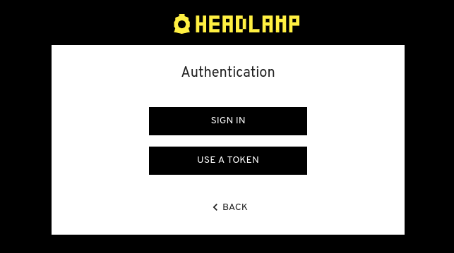

Headlamp supports OIDC for cluster users to effortlessly log in using a "Sign in" button.



To use OIDC, Headlamp needs to know how to configure it, so you have to provide the following OIDC-related arguments to Headlamp from your OIDC provider:

- the client ID: `-oidc-client-id` or env var `HEADLAMP_CONFIG_OIDC_CLIENT_ID`
- the client secret: `-oidc-client-secret` or env var `HEADLAMP_CONFIG_OIDC_CLIENT_SECRET`
- the issuer URL: `-oidc-idp-issuer-url` or env var `HEADLAMP_CONFIG_OIDC_IDP_ISSUER_URL`
- (optionally) the OpenId scopes: `-oidc-scopes` or env var `HEADLAMP_CONFIG_OIDC_SCOPES`

and you have to tell the OIDC provider about the callback URL, which in Headlamp it is your URL + the `/oidc-callback` path, e.g.:
`https://YOUR_URL/oidc-callback`.

### Callback URL

You must tell your OIDC provider the callback URL that Headlamp will use after login. This is your Headlamp URL plus `/oidc-callback`, for example:

```
https://YOUR_URL/oidc-callback
```

> **ℹ️ Note:** If you're running Headlamp behind an ingress or load balancer (e.g., NGINX, AWS ALB/NLB), make sure it forwards the `X-Forwarded-Proto` header. Otherwise, Headlamp may generate the callback URL using `http` instead of `https`, which can cause a mismatch with your OIDC provider.
>
> For [NGINX ingress](https://kubernetes.github.io/ingress-nginx/user-guide/nginx-configuration/annotations/), you can add:
>
> ```yaml
> nginx.ingress.kubernetes.io/configuration-snippet: |
>   proxy_set_header X-Forwarded-Proto $scheme;
> ```

### Troubleshooting: Real time updates not working, Large JWT Tokens with Ingress NGINX

If you notice real time updates not working, this could be the cause.

If your OIDC provider issues large JWT tokens (e.g., >8KB), you may encounter issues with WebSocket connections or authentication headers being truncated when using Headlamp behind an Ingress NGINX controller.

To resolve this, increase the header buffer size using the following annotation in your [NGINX Ingress](https://kubernetes.github.io/ingress-nginx/user-guide/nginx-configuration/annotations/) resource:

```yaml
nginx.ingress.kubernetes.io/server-snippet: |-
  large_client_header_buffers 4 64k;
```

> **ℹ️ Note:** Regular HTTP requests may still work even with large tokens, but WebSocket connections are more sensitive to header size limits and may fail unless this buffer is increased.

### Scopes

Besides the mandatory _openid_ scope, Headlamp also requests the optional
_profile_ and _email_
[scopes](https://openid.net/specs/openid-connect-basic-1_0.html#Scopes).
Scopes can be overridden by using the `-oidc-scopes` option. Remember to
include the default ones if you need them when using that option.
For example, if you need to keep the default scopes and add Github's `repo`,
then add them all to the option:

`-oidc-scopes=profile,email,repo`

**Note:** Before Headlamp 0.3.0, a scope _groups_ was also included, as it's
used by Dex and other services, but since it's not part of the default spec,
it was removed in the mentioned version.

### Token Validation Overrides

In the event your OIDC Provider issues `access_tokens` from a different Issuer URL or clientID audience than its `id_tokens` (i.e. Azure Entra ID) you may have need of the following parameters to configure what is used in validation of tokens.

- `-oidc-validator-client-id=<clientID audience to validate in token>` or env var `HEADLAMP_CONFIG_OIDC_VALIDATOR_CLIENT_ID` which is the clientID headlamp should be verifying in the `aud` field of the token provided back from the OIDC provider.
- `-oidc-validator-idp-issuer-url=<issuerURL to use in validation>` or env var `HEADLAMP_CONFIG_OIDC_VALIDATOR_IDP_ISSUER_URL` which is the IssuerURL headlamp should be verifying in the `iss` field of the token provided back from the OIDC Provider

### Use Access Tokens instead of ID Tokens

By default, headlamp leverages the `id_token` provided back from the OIDC Provider after authentication returned to the `/oidc-callback` endpoint. For some Identity Providers like Azure Entra ID, the `access_token` is what is used for authorization to Kubernetes clusters. To instruct headlamp to use the `access_token` instead of the `id_token`, the following flag can be used.

- `-oidc-use-access-token=true` or env var `HEADLAMP_CONFIG_OIDC_USE_ACCESS_TOKEN`

### Multi-cluster: broadcast the OIDC token across sibling clusters

When a single Headlamp instance serves several Kubernetes clusters that all trust the **same** OIDC application (same issuer URL and client ID), an operator can opt in to broadcasting the auth cookie to every matching sibling cluster after a successful login. This eliminates per-cluster re-authentication for the common deployment shape where one OIDC app (Okta, Keycloak, Dex, Entra ID, etc.) is registered with every `kube-apiserver` in the fleet.

- `-oidc-use-token-broadcast=true` or env var `HEADLAMP_CONFIG_OIDC_USE_TOKEN_BROADCAST`

**Precondition.** A sibling cluster receives the broadcast only when its kubeconfig context's OIDC auth-provider has BOTH a non-empty `idp-issuer-url` AND a non-empty `client-id` that match the source cluster's. Contexts using a different auth-provider (e.g. `gcp`, `azure`) or a static token are skipped silently.

**Scope.** Broadcasting fires at initial OIDC login and broadcasts whichever token is in use (the `id_token`, or the `access_token` when `-oidc-use-access-token=true`). Token-refresh broadcasting is tracked as a follow-up. Because token refresh happens independently per cluster, sibling cookies diverge as soon as any one cluster refreshes its token; until refresh broadcasting lands, the affected clusters fall back to per-cluster re-login (commonly ~1h on EKS / Okta with default settings).

**Caveats to be aware of before enabling.**

- The flag is **disabled by default**; existing deployments see zero behavior change.
- Audience mismatches are not detected here. A target apiserver's accepted audiences come from its OIDC client ID (`--oidc-client-id`) or the `audiences` list in a structured [AuthenticationConfiguration](https://kubernetes.io/docs/reference/access-authn-authz/authentication/#using-authentication-configuration); if a target is configured to require a different or additional audience than the source, the broadcast cookie may be set but the target apiserver could reject the token. Align deployment configuration in that case.
- When `-oidc-use-access-token=true`, the broadcast carries the `access_token` rather than the `id_token`. Unlike the `id_token`, an access token's audience is provider-specific and is frequently **not** the client ID (many IdPs — Okta, Entra ID, Auth0 — set it to a resource/API identifier). Matching issuer + client ID therefore does not by itself guarantee the access token is accepted by a sibling apiserver; ensure the access-token audience is honored fleet-wide before relying on broadcast with this flag.
- Each target cluster receives one or more `Set-Cookie` headers per login, so enabling this with very large multi-cluster kubeconfigs may approach browser and proxy cookie count / size limits.
- Pre-existing chunk-cookie limitation: stale chunk cookies on cluster paths are not actively cleared during login because cookies live under `/clusters/<cluster>` while OIDC login completes on `/oidc-callback`. In the rare case a re-issued token uses fewer chunks than the previous one, the affected cluster(s) may need a one-time re-login.

### Example: OIDC with Keycloak in Minikube

If you are interested in a comprehensive example of using OIDC and Headlamp,
you can check the
[tutorial on setting up OIDC with Keycloack in Minikube](./keycloak/).

### Example: OIDC with Entra ID in AKS

If you are interested in a comprehensive tutorial of using OIDC and Headlamp in AKS,
you can check the
[tutorial on setting up OIDC with Entra ID in AKS](./azure-entra-id/).

For quick reference if you are already familiar with setting up Entra ID,

- Add the callback URL (e.g. `https://YOUR_URL/oidc-callback`) to your Azure App Registration's `redirectURIs`
- Set `-oidc-client-id` to your Azure App Registration's clientID
- Set `-oidc-client-secret` to your Azure App Registration's clientSecret
- Set `-oidc-idp-issuer-url` to `https://login.microsoftonline.com/<Your Azure Directory (tenant) ID>/v2.0`
- Set `-oidc-scopes` to `6dae42f8-4368-4678-94ff-3960e28e3630/user.read,openid,email,profile`
- Set `--oidc-validator-idp-issuer-url` to `https://sts.windows.net/<Your Directory (tenant) ID>/`
- Set `-oidc-validator-client-id` to `6dae42f8-4368-4678-94ff-3960e28e3630`
- Set `-oidc-use-access-token=true`


### Example: OIDC with Dex

If you are using Dex and want to configure Headlamp to use it for OIDC,
then you have to:

- Add the callback URL (e.g. `https://YOUR_URL/oidc-callback`) to Dex's `staticClient.redirectURIs`
- Set `-oidc-client-id` as Dex's `staticClient.id`
- Set `-oidc-client-secret` as Dex's `staticClient.secret`
- Set `-oidc-idp-issuer-url` as Dex's URL (same as in `--oidc-issuer-url` in the Kubernetes APIServer)
- Set `-oidc-scopes` if needed, e.g. `-oidc-scopes=profile,email,groups`

**Note** If you already have another static client configured for Kubernetes for the [apiserver's OIDC](https://kubernetes.io/docs/reference/access-authn-authz/authentication/#configuring-the-api-server) (OpenID Connect) configuration, use a **single static client ID** i.e `-oidc-client-id` for both Dex and Headlamp. Additionally, the **redirectURIs** need to be specified for each client.

### Impersonate the OIDC user instead of forwarding their token

By default, `--in-cluster` Headlamp forwards the user's raw OIDC token to the Kubernetes API server as the `Authorization: Bearer` credential, and the **API server** is what authenticates it. If the API server does not trust Headlamp's OIDC issuer directly — common on managed offerings whose control plane cannot reach an issuer that is only resolvable inside the cluster's own network, or whose operator has not registered it — every request fails with `401 Unauthorized` even though the OIDC login itself succeeded (see the troubleshooting section below).

`--oidc-use-impersonation` (or env var `HEADLAMP_CONFIG_OIDC_USE_IMPERSONATION`) is the opt-in alternative: Headlamp authenticates to the API server using its own in-cluster service account token (which the API server already trusts natively), verifies the caller's OIDC ID token itself, and sets `Impersonate-User` / `Impersonate-Group` from the verified claims instead of forwarding the token. This is the same mechanism `kubectl --as` and proxies like [kube-oidc-proxy](https://github.com/jetstack/kube-oidc-proxy) rely on: a trusted identity re-presents a request on behalf of another identity, and the API server's RBAC runs against the impersonated identity, not the trusted one.

**Requirements:**

- `--in-cluster` must be set.
- OIDC must be configured (`-oidc-client-id`, `-oidc-idp-issuer-url`, `-oidc-scopes`).
- The pod's service account must be granted the `impersonate` verb on `users`, `groups` and `serviceaccounts`. For example:

  ```yaml
  apiVersion: rbac.authorization.k8s.io/v1
  kind: ClusterRole
  metadata:
    name: headlamp-impersonator
  rules:
    - apiGroups: ['']
      resources: ['users', 'groups', 'serviceaccounts']
      verbs: ['impersonate']
  ---
  apiVersion: rbac.authorization.k8s.io/v1
  kind: ClusterRoleBinding
  metadata:
    name: headlamp-impersonator
  roleRef:
    apiGroup: rbac.authorization.k8s.io
    kind: ClusterRole
    name: headlamp-impersonator
  subjects:
    - kind: ServiceAccount
      name: headlamp
      namespace: headlamp
  ```

  This is a deliberate, explicit grant; nothing is escalated automatically. The impersonated user's own RBAC still governs what they can do.

- The username and groups are resolved from the verified token's claims using the existing `-me-username-path` / `-me-groups-path` expressions (the same ones the `/me` endpoint uses); no new claim-mapping flags are introduced.

**Incompatible flags.** `--oidc-use-impersonation` cannot be combined with:

- `--unsafe-use-service-account-token`: that flag already authenticates every request as the service account without impersonating anyone, so combining the two would make `--oidc-use-impersonation` silently inert.
- `-oidc-use-access-token`: the identity is verified from the ID token's signature, issuer, audience and expiry, which an access token does not carry in the same way.

`--service-account-token-path` is still accepted with it: that file is the credential used to impersonate, the same as under `--unsafe-use-service-account-token`.

**Cookie scope.** Headlamp's auth cookie is normally scoped to one cluster's routes. With impersonation it is scoped to the whole Headlamp deployment instead, because the WebSocket multiplexer and node drain endpoints are not cluster-scoped paths, and impersonation needs the verified identity there too. This only applies to clusters where impersonation is in effect; it does not change cookie behavior for other clusters or for deployments that do not set this flag.

### Troubleshooting: OIDC sign-in succeeds but the cluster rejects your token

If you can sign in via OIDC but are returned to the "Sign in" screen with a message that the cluster rejected your token (and cannot load cluster resources), the cluster's **API server** is most likely not configured to trust the same OIDC provider as Headlamp. Headlamp only forwards the token to the API server, and the API server is what accepts or rejects it, so it must be OIDC-aware with a matching issuer, client ID, and audience.

Make sure the API server is configured for the same OIDC provider (via its `--oidc-issuer-url` / `--oidc-client-id` flags or the equivalent [structured authentication configuration](https://kubernetes.io/docs/reference/access-authn-authz/authentication/#configuring-the-api-server)), so that `--oidc-issuer-url` matches Headlamp's `-oidc-idp-issuer-url` and `--oidc-client-id` matches Headlamp's `-oidc-client-id`.

Managed control planes (e.g. AKS, EKS, GKE) may not accept arbitrary OIDC flags on the API server. If that is the case, use the provider's managed identity/OIDC integration instead, or see [Impersonate the OIDC user instead of forwarding their token](#impersonate-the-oidc-user-instead-of-forwarding-their-token) above for an alternative that keeps the token verification in Headlamp itself. When the API server rejects the token, Headlamp logs a warning containing `API server rejected the forwarded bearer token (401)`.
