# Filter Resources by Labels

You can filter Kubernetes resources by labels to find specific Pods, Deployments, Services, and other resources.

## How to Use

When no filters are active, click the filter icon beside the resource title's Create action. The
**Namespaces** and **Label Selector** fields open beneath the title. Type a selector and press
**Enter**. Hover over or focus the information icon for common query examples. The field supports
the full Kubernetes label selector syntax, exactly the same syntax accepted by `kubectl -l`.

Active values are shown as compact subtitle links beneath the resource title. They look like
subtitles until hover or keyboard focus gives them link styling. Hover identifies the filter, and
clicking either value reopens the labeled editor fields.

Experienced Kubernetes users may already know this query syntax from `kubectl`. The examples
tooltip makes the same syntax discoverable for newer users without taking up permanent screen
space. Open it by hovering over, focusing, or tapping the information icon.

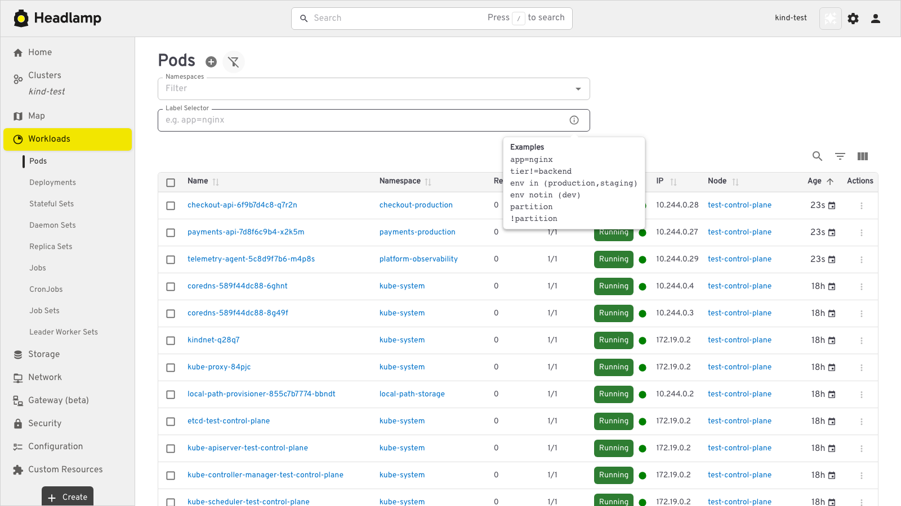

**Examples:**

Find resources with `app=nginx`:

```
app=nginx
```

Find resources with multiple labels (both must match):

```
app=nginx,env=production
```

Find resources where `env` is `production` or `staging`:

```
env in (production,staging)
```

Find resources where `tier` is not `backend`:

```
tier!=backend
```

Invalid selectors remain in the editor with an error message. Headlamp does not save them, add
them to the URL, or send them to Kubernetes.

## Filter from Resource Details

On a resource details page, click a label to open the list for the same resource type with that
label applied as a filter. This works for Pods and other Kubernetes resource types.

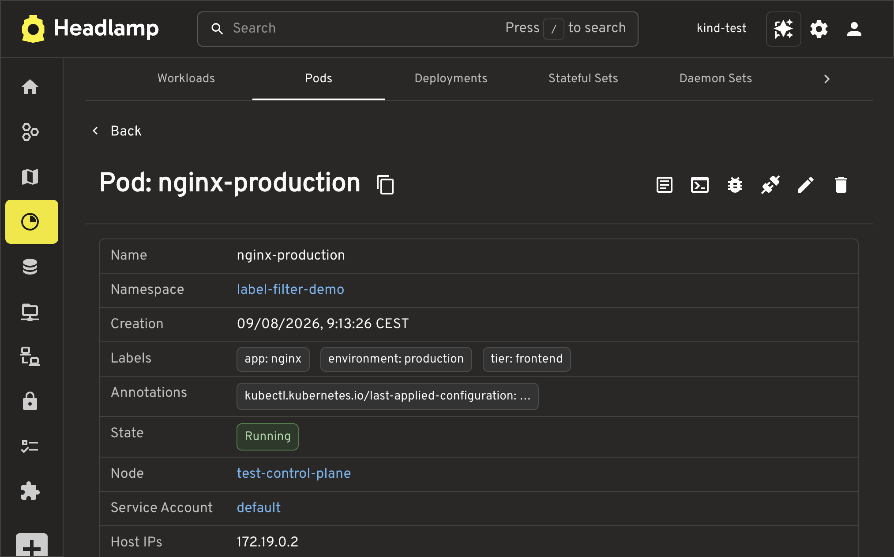

The matching resource list opens with the **Label Selector** filter filled in and reflected in the
URL.

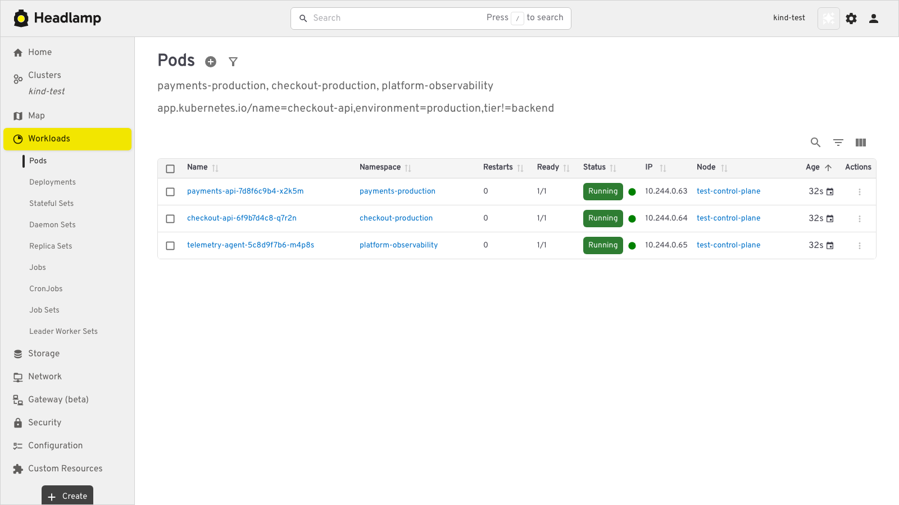

## Filter from Selectors

Selector chips on resource details pages use the same workflow. A Pod's **Node Selectors** open
the Nodes list, while workload and other resource **Selector** chips open the Pods list. The
selector is passed to Kubernetes as a `labelSelector` query, so the API server returns only
matching resources.

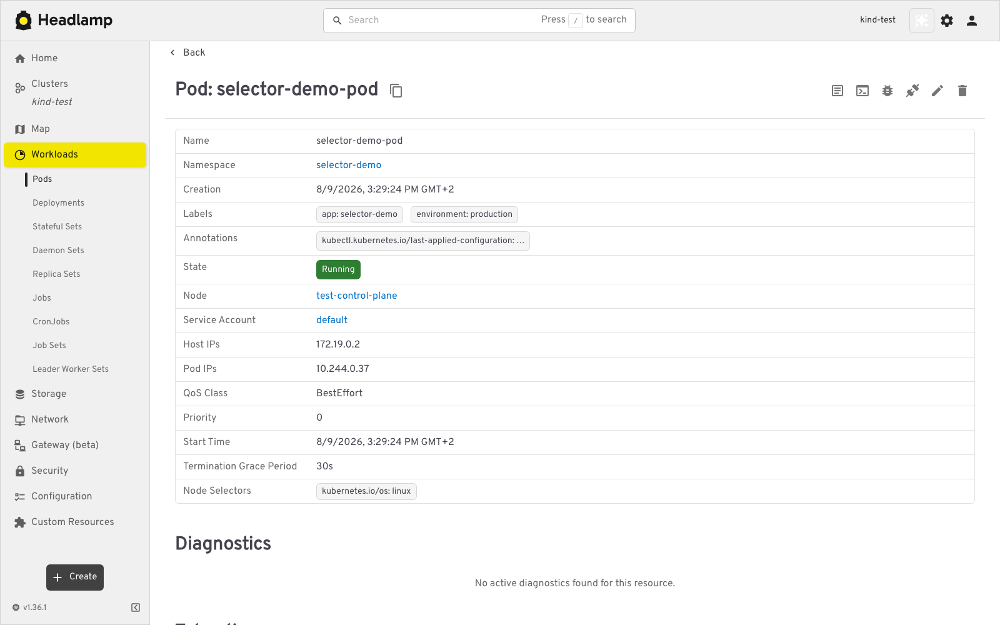

Workload details link their Pod Selector and Node Selector to their corresponding resource lists.

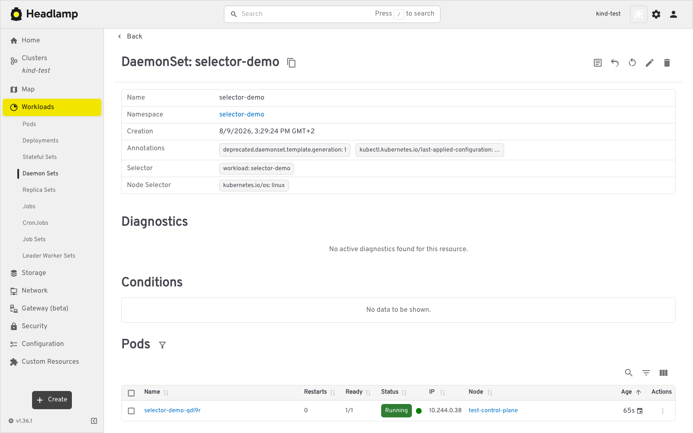

## Global search works with Kubernetes selectors now

Type a Kubernetes label selector into global search, for example
`environment in (production),tier in (frontend)`. Headlamp shows a result for each resource type
with at least one match, such as **Pods**. Click the result to open that resource list with the
selector applied.

Headlamp asks Kubernetes for only one matching object per resource type while building these
results. This keeps the search lightweight and avoids downloading entire unfiltered resource lists.

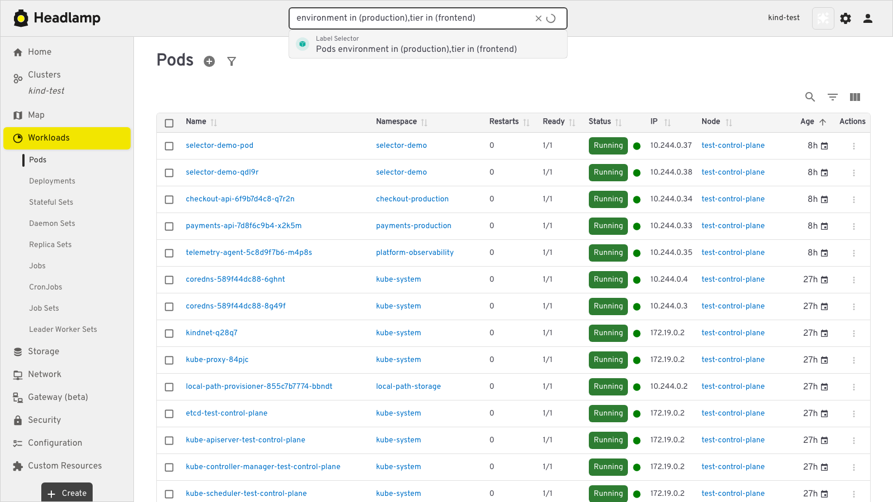

## Responsive Layout

Active Namespaces and Label Selector values appear as MUI-style subtitle links beneath the resource
title, with Namespaces always first. The filter icon remains beside Create and toggles the editor.
Applying a value with **Enter** returns to subtitle display mode.

### Cleaner when no filters are set

If no selectors are set, then they are not shown. This is cleaner than before because there is no
empty Namespaces input when Namespaces is empty. Instead, use the filter icon to filter by namespace
or label selector.

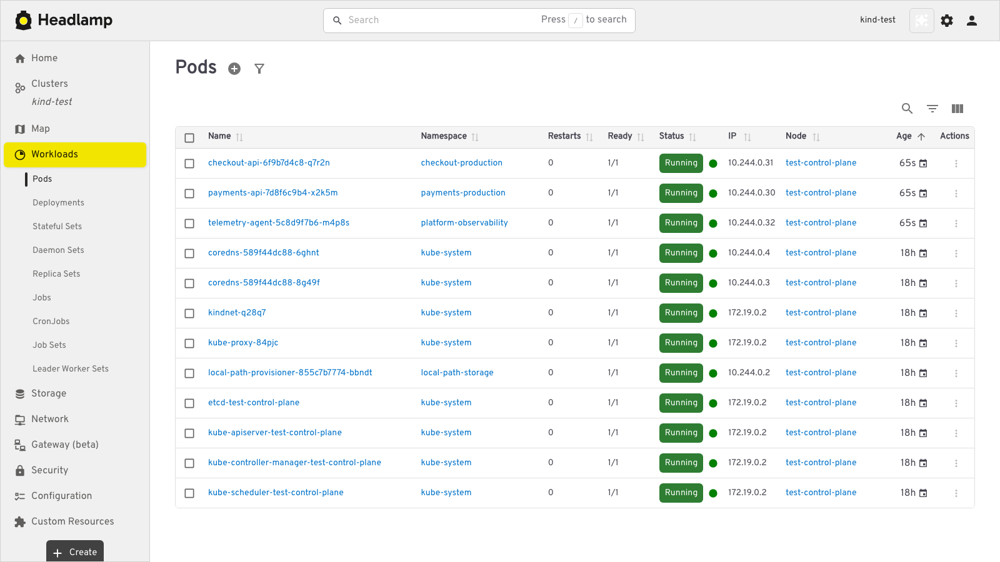

### Subtitles, before they could be missed

On the main branch, wide screens push namespace context to the far right of the resource title row.
The large gap makes the active namespace filter easy to miss, even with three namespaces selected.

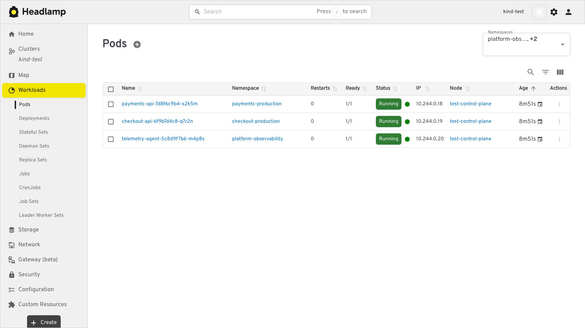

#### After

Now you know what namespaces this view is for. Before it was very easy to miss, and even if you
noticed, you needed to click the namespace filter box to see.


#### Hover

The values keep subtitle styling at rest. On hover or keyboard focus, link styling and a descriptive
tooltip make the editing action discoverable.

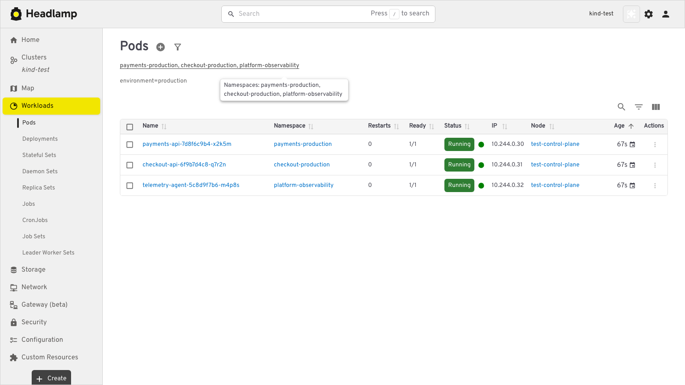

#### Clicking filter selector icon or clicking on a selector brings up selector edit input fields

When neither filter is set, the filter icon directly after the Create action opens the editable
fields beneath the title. While editing, the same action hides the fields and returns to display
mode.

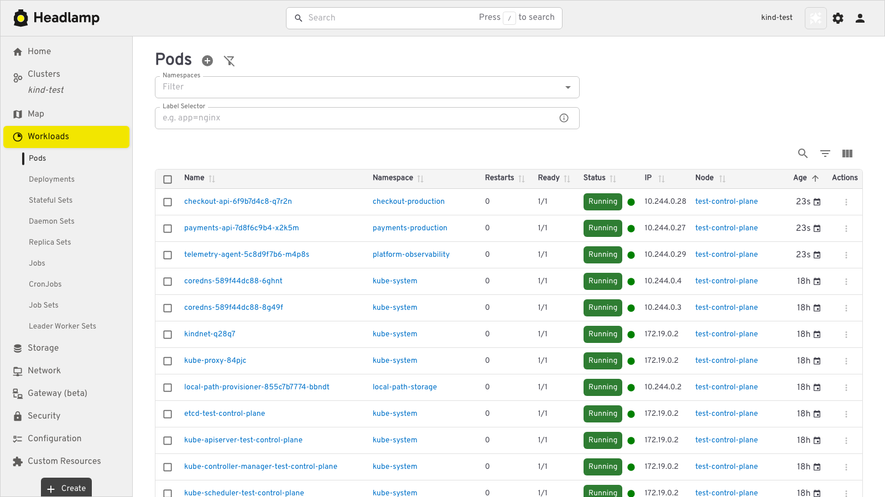

### Mobile

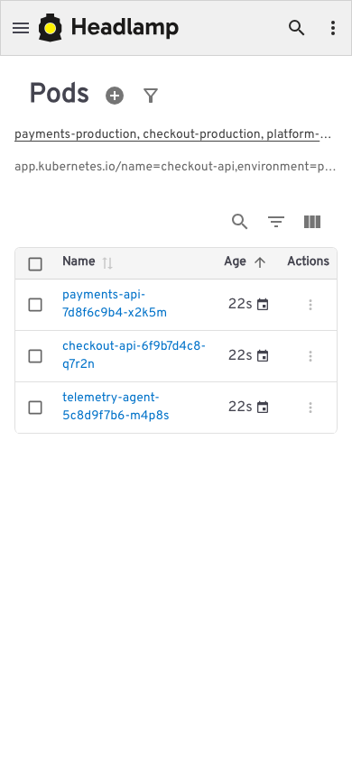

The editable fields use the available mobile width and keep the matching resources visible below.

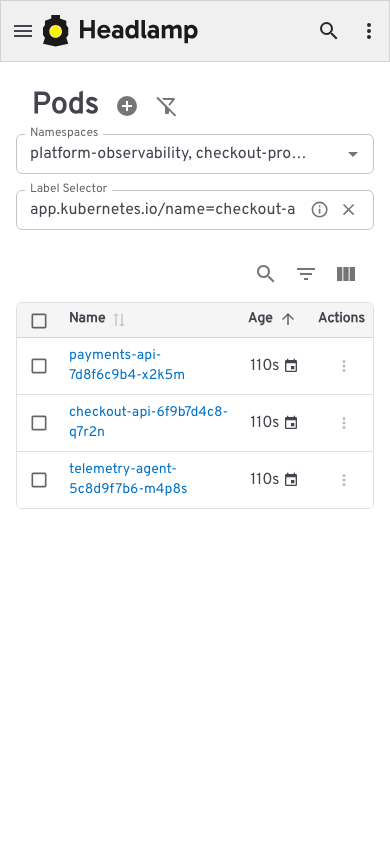

### Medium

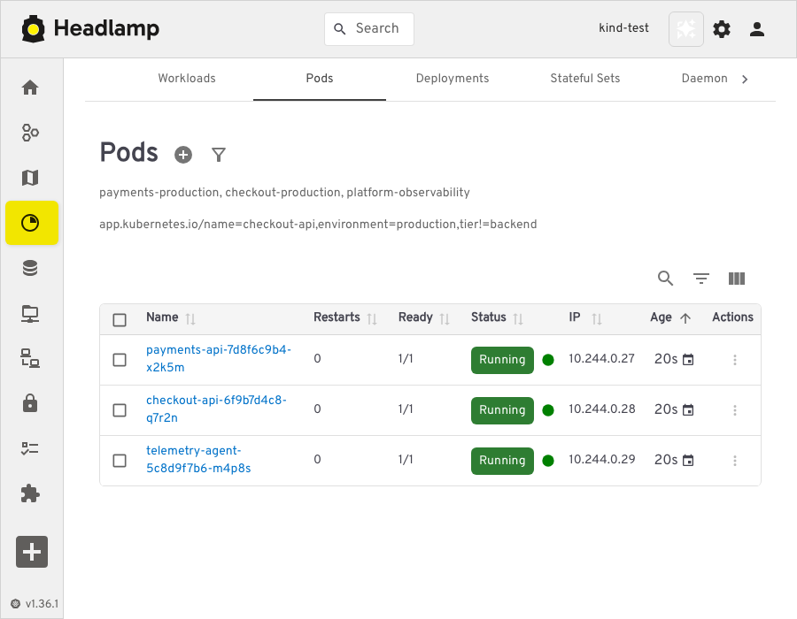

### Large

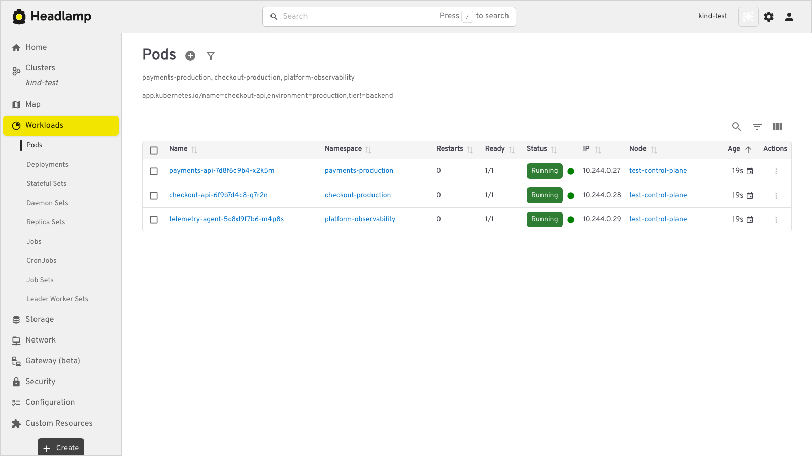

## Clear Filter

Click the **X** button inside the input field.

## Keyboard Shortcuts

- **Enter** - Apply filter
- **Escape** - Clear filter

## Notes

- Filters are saved in your browser for each cluster
- Filters appear in the URL so you can share filtered views
- You can use label filters together with namespace filters
